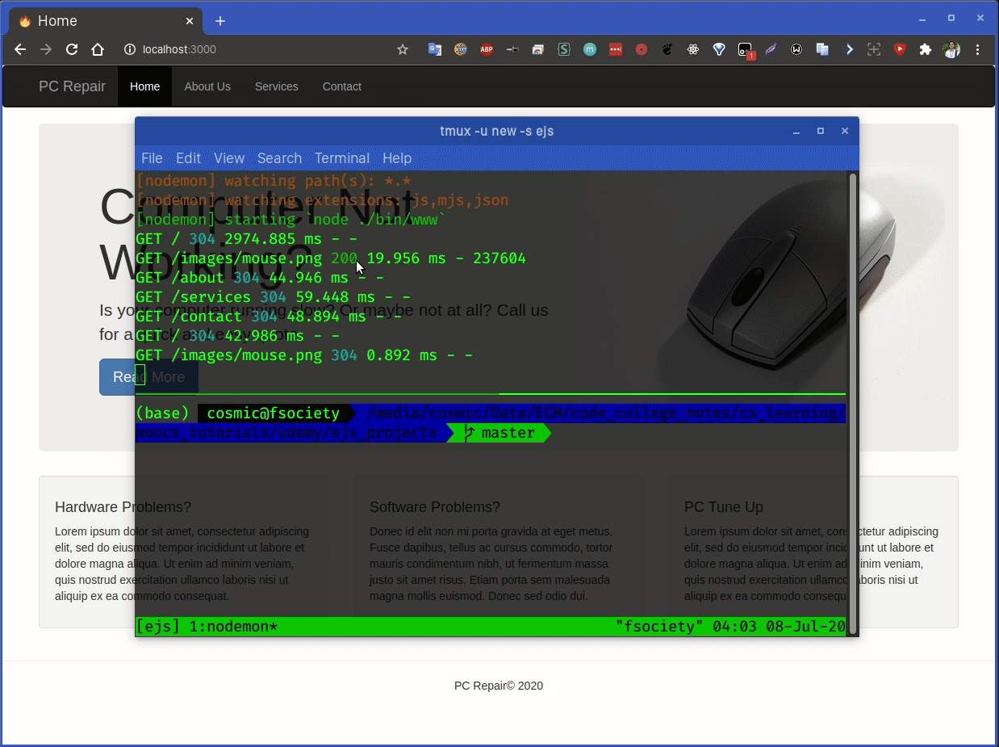

# 03. Build a PC Repair Website



## 03_01 Pug and Template Engines

- In this project we use Express Generator, which will generate an express boilerplate application. We will also work with **Pug/Jade** which is a Node.js Template Engine.

### What is a template engine ?
- Template engine enables us to use static template files in our app. Variables in templates are replaced at runtime. Most template engines allow variables, conditionals and loops.
- Some of the popular engines include Pug/Jade, EJS, Handlebars and Mustache.

### Implementing a Template Engine

- Install like any other node module `npm install pug --save`.

```js
// app.js
app.set('views',path.join(__dirname,'views')); // Tell the system where the views folder will be.
app.set('view engine','pug'); // Setting the engine, in our case pug
```
<!-- In Route to render template -->

```js
res.render('index',{title:'Express'}); // Passing in the variable title with String express.
```

### Pug/Jade

- Formerly known as Jade but project was renamed to Pug. Pug will still occupy the "Jade" package name. There are some small changes in syntax and API.

- In pug instead of working with HTML tags we are working with indents. Attributes go inside (). For container we do "#" and "." for a class.


## 03_02 Express Generator File Structure

- This will generate an application, a package.json manifest file, app.js file, routes and other basic things required to get started. Basically a boiler plate. To install run `npm install express -g && npm install express-generator -g`.
- Now inside pcrepair we have to run `npm install` as it reads the dependencies from manifest file and install them.
- Inside views folder we have `layout.pug`, this is where we will put all the code that we want to be present on other pages as well by calling extends layout.
- `express pcrepair --view=pug` to create a starter template with pug as view engine.

```pug
doctype html
html
  head
    title= title
    link(rel='stylesheet', href='/stylesheets/style.css')
  body
    block content
```

## 03_03 Pug Homepage layout

- Include the stylesheet in layout.pug.

```pug
link(rel='stylesheet', href='https://stackpath.bootstrapcdn.com/bootstrap/3.4.1/css/bootstrap.min.css',integrity="sha384-HSMxcRTRxnN+Bdg0JdbxYKrThecOKuH5zCYotlSAcp1+c8xmyTe9GYg1l9a69psu",crossorigin="anonymous")
```

- Next we want to include the navbar, but if you are like me and you don't want to type out all the indentations when going from HTML to pug you can go to [this](https://html2jade.org) website and paste in your HTML content to get back Jade/Pug equivalent.

```pug
nav.navbar.navbar-inverse.navbar-fixed-top
      .container
        .navbar-header
          button.navbar-toggle.collapsed(type='button', data-toggle='collapse', data-target='#navbar', aria-expanded='false', aria-controls='navbar')
            span.sr-only Toggle navigation
            span.icon-bar
            span.icon-bar
            span.icon-bar
          a.navbar-brand(href='#') PC Repair
        #navbar.collapse.navbar-collapse
          ul.nav.navbar-nav
            li(class=title=='Home' ? 'active' : undefined)
              a(href='/') Home
            li(class=title=='About' ? 'active' : undefined)
              a(href='/about') About
            li(class=title=='Services' ? 'active' : undefined)
              a(href='/services') Services
            li(class=title=='Contact' ? 'active' : undefined)
              a(href='/contact') Contact
    .container

```

## 03_04 About Services - Pulling JSON Data

- For services we will fetch data from a JSON document and we will put all the services inside JSON and how we can grab it and put it into a template.
- Start with about, create about.js in routes folder. Copy the basic structure from index.js but change the title and in app.js add path for about.
- After that go to views directory and create about.pug.
- Create a fodler in root and name it json. Create a file inside json directory services.json
- We are done with Home,About and Services page, next up we will make Contact page using node module Nodemailer.Nodemailer is a module for Node.js applications to allow easy as cake email sending.

## 03_05 Contact - Nodemailer Contact Form

- Create routes/contact.js. Copy everything from index.js as starter and edit it out.
- Add routes in app.js.
- Create the form in contact.pug using pug templating and after that we install nodemailer.
- Go to ethereal.email for fake email to test your nodemailer install.
- Go to contact.js and add in the config for nodemailer. Define a route for post requests using router.post in contact.js.


## Screenshots depicting contact form in action:

>## Enter the data on site's contact form:


>## Message sent notification in console and redirect to homepage.


>## Multiple Emails Sent During Testing


>## Screenshot of Email showing req.body.param working properly

